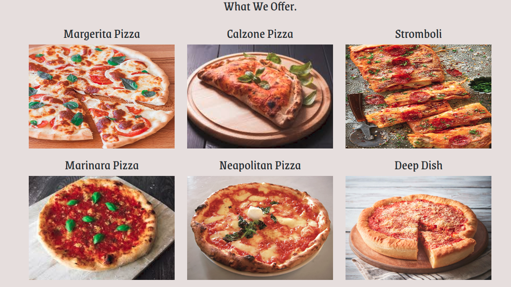

# PIZZA HUT
#### This project enables users to order pizzas online and even receive their deliveries at home, October 2019.
#### By **Margaret254**&trade;

## Description
This is a pizza shop website where users can order one or even more pizzas  and also they can receive their deliveries at their homes.
## Project live site
  This is the live link .[ https://github.com/margaret254/pizza ]()

  

## Setup instructions
* Clone the program from [Online repo]()
* Click on the green button to clone or download
* open your terminal 
* cd into Documents/moringa-prep/pizza
* open with your favourite text editor, for vs code,code . or atom . for atom.

## Behavior Driven Development
<table>
    <tr>
      <th>Behavior</th> 
      <th>Input</th> 
      <th>Output</th>   
    </tr>
    <tr>
        <td>on load</td>
        <td>scroll and see different pizza images and names </td>
        <td>look at the ones you like</td>
    </tr>
     <tr>
        <td>on order online</td>
        <td>click on order now or scroll down to order now and order </td>
        <td>on checkout you will see what you have ordered and the bill to be paid</td>
    </tr> 
    <tr>
        <td>Enter your name if you want to leave a message</td>
        <td>['Serah']</td>
        <td>name = 'Serah'</td>
    </tr>
    <tr>
        <td>Enter Email && Message</td>
        <td>['Email','Message']</td>
        <td>Email && Message</td>
    </tr>
    <tr>
        <td>Submit</td>
        <td>Email && Message</td>
        <td>Hi Serah we have received your message and we will get in touch. Thank you for contacting us</td>
    </tr>
       
</table>

## Technologies Used
* HTML-For Building Mark Up pages
* CSS-For styling User Interface
* Bootsrap-For making webpage responsive
* JQuery-For animations and cool effects of the website like hiding and showing elements
* Javascript-For DOM(Document Object Manipulation)scripts

## Support and contact details
contact me https://github.com/margaret254/pizza/issues
### License
The project is under[MIT license](/blob/master/LICENSE)
Copyright &copy; 2019.All rigths reserved
  